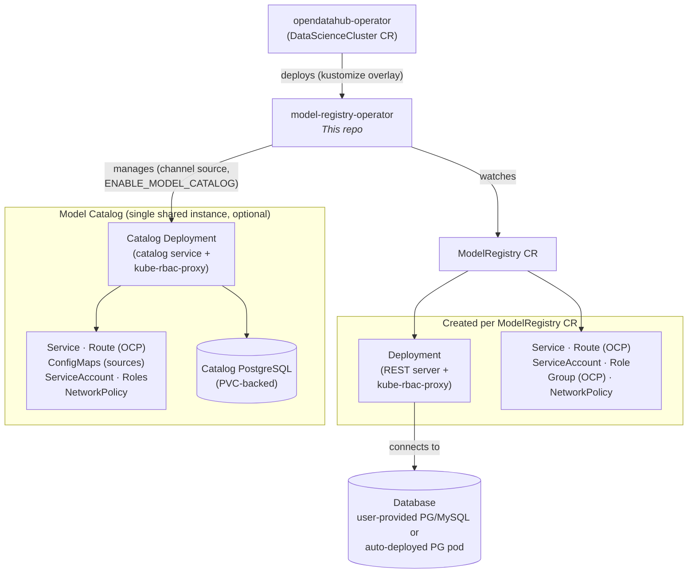

# AGENTS.md

This file provides guidance to AI Agents working with code in this repository.

## Commands

### Build and Test
- `make docker-build` - Build the docker image (primary build command)
- `make test` - Run all tests with coverage (runs manifests, generate, fmt, vet, govulncheck first)
- `go test ./...` - Run tests without generation steps (faster iteration)
- `ginkgo run -v internal/controller` - Run controller tests specifically
- `ginkgo run -v api/v1beta1` - Run webhook tests for v1beta1
- `ginkgo run -v internal/migration` - Run migration tests

### Code Generation (run after API changes)
- `make manifests` - Generate CRDs, RBAC, and webhook configs from kubebuilder markers
- `make generate` - Generate DeepCopy methods and conversion code

### Dev Cluster Testing
Test against a pre-configured OpenShift dev cluster:

1. **One-time setup** - Enable the OpenShift image registry default route:
   ```sh
   oc patch configs.imageregistry.operator.openshift.io/cluster --type merge -p '{"spec":{"defaultRoute":true}}'
   ```

2. **Build and push** - Set `IMG_REGISTRY`, `DOCKER_USER`, `DOCKER_PWD`; the Makefile handles tagging:
   ```sh
   make docker-login
   make docker-build
   make docker-push
   ```
   The user may use `direnv` with `.envrc` to set these automatically (see `.envrc.example`).

3. **Deploy to cluster** - Patch the running pod (temporary, lost on restart):
   ```sh
   oc patch pod -n opendatahub $(oc get pods -n opendatahub -l app.opendatahub.io/model-registry-operator=true -o jsonpath='{.items[0].metadata.name}') \
     --patch='{"spec":{"containers": [{"name": "manager", "image": "image-registry.openshift-image-registry.svc:5000/opendatahub/model-registry-operator:latest"}]}}'
   ```
   Or scale down the ODH operator and patch the deployment (survives pod restarts, but disables DSC reconciliation):
   ```sh
   oc scale deployment --replicas=0 -n openshift-operators opendatahub-operator-controller-manager
   oc patch deployment -n opendatahub model-registry-operator-controller-manager \
     --patch='{"spec": {"template": {"spec":{"containers": [{"name": "manager", "image": "image-registry.openshift-image-registry.svc:5000/opendatahub/model-registry-operator:latest"}]}}}}'
   ```
   To refresh: push a new image, then delete the old pod or re-patch the deployment.

## Architecture

Kubebuilder-based operator that deploys Model Registry instances from `ModelRegistry` Custom Resources.

### Context & Upstream Dependencies
This repo is one piece of a larger system:
- **[opendatahub-io/model-registry](https://github.com/opendatahub-io/model-registry)** — the actual Model Registry server (Go/REST). This operator deploys it via the `REST_IMAGE` container image.
- **[opendatahub-io/opendatahub-operator](https://github.com/opendatahub-io/opendatahub-operator)** — the parent ODH operator. It deploys *this* operator via the `config/overlays/odh/` kustomize overlay when `modelregistry.managementState: Managed` is set in the DataScienceCluster CR.



### Controllers
- **ModelRegistryReconciler** (`internal/controller/modelregistry_controller.go`) - Reconciles each `ModelRegistry` CR into a Deployment, Service, ServiceAccount, Role, Route, NetworkPolicy, and kube-rbac-proxy config.
- **ModelCatalogReconciler** (`internal/controller/modelcatalog_controller.go`) - Manages a single shared model catalog. Triggered by a channel source, not a CR. Deploys catalog service, postgres, and MCP server.

### API Versions
- `api/v1beta1/` - Hub (storage) version, marked with `+kubebuilder:storageversion`
- `api/v1alpha1/` - Spoke version with auto-generated conversion (`zz_generated.conversion.go`)
- Conversion webhook registered in `internal/webhook/` alongside custom mutating/validating webhooks

### Webhook Registration
Webhooks implement `admission.Handler` directly, not the `webhook.Defaulter`/`webhook.Validator` interfaces. The defaulter and validator register via `mgr.GetWebhookServer().Register()` in `internal/webhook/modelregistry_webhook.go`. The conversion webhook registers via `ctrl.NewWebhookManagedBy(mgr).For(&v1beta1.ModelRegistry{}).Complete()`.

### Template-Based Resource Creation
Embedded Go `text/template` files (`//go:embed`) generate Kubernetes resources:
- `internal/controller/config/templates/*.yaml.tmpl` - Core (deployment, service, etc.)
- `internal/controller/config/templates/kube-rbac-proxy/*.yaml.tmpl` - Auth proxy
- `internal/controller/config/templates/catalog/*.yaml.tmpl` - Catalog

`TemplateApplier.Apply()` renders each template with `ModelRegistryParams` (name, namespace, spec).

### Cluster Capability Detection
At startup (`cmd/main.go`), the operator probes the discovery API for:
- `IsOpenShift` - Enables Routes, Groups, RoleBindings
- `HasUserAPI` - Controls Group creation (absent in BYOIDC mode)
- `HasConfigAPI` - Reads cluster ingress domain

### Cache Configuration
The manager caches only operator-created resources, filtered by label `app.kubernetes.io/created-by: model-registry-operator`. Secrets bypass the cache (`DisableFor`) because they are user-provided (DB credentials, TLS certs).

### Storage Migration
`internal/migration/` migrates CRD storage versions between API versions via a strategy pattern (manual rewrite or StorageVersionMigration API).

### Security Modes
- **Plain** - No auth proxy
- **kube-rbac-proxy** - Sidecar proxy with TokenReview/SubjectAccessReview (current)
- **OAuth Proxy** - Legacy, auto-migrated to kube-rbac-proxy in reconciler

### RBAC Markers
`+kubebuilder:rbac` comments live in two files:
- `internal/controller/modelregistry_controller.go`
- `internal/controller/kubebuilder.go`

Each list MUST end with an empty newline or generation breaks.

### Environment Variables
Operator configuration (see `internal/controller/config/defaults.go`):
- `REGISTRIES_NAMESPACE` - Target namespace for registries
- `ENABLE_WEBHOOKS` - Toggle webhooks (default: true in-cluster, false for `make run`)
- `DEFAULT_DOMAIN` - Route domain override
- `ENABLE_MODEL_CATALOG` - Toggle catalog controller
- Image overrides: `REST_IMAGE`, `KUBE_RBAC_PROXY_IMAGE`, `POSTGRES_IMAGE`, `CATALOG_DATA_IMAGE`

### Kustomize Layout (`config/`)
- `config/crd/` — Generated CRD manifests (bases) and patches (webhook CA injection, conversion)
- `config/default/` — Base kustomization that composes CRD, manager, RBAC, webhook, and cert-manager
- `config/overlays/odh/` — Production overlay used by the ODH operator; adds auth proxy, webhook patches, Istio config, and `params.env` for image/domain overrides
- `config/manager/` — Operator Deployment manifest
- `config/rbac/` — ClusterRole, ServiceAccount, and role bindings for the operator itself
- `config/webhook/` — Mutating/validating/conversion webhook configurations
- `config/samples/` — Example `ModelRegistry` CRs with various DB and auth combinations
- `config/jobs-async-upload/` — OpenShift Templates for async model upload jobs (S3/URI/HF to OCI); see its own [README](config/jobs-async-upload/README.md)

## Testing

- Ginkgo/Gomega with envtest (in-process API server)
- Five suites: `api/v1alpha1`, `api/v1beta1`, `internal/controller`, `internal/controller/config`, `internal/migration`
- Controller suite downloads the OpenShift Route CRD from GitHub at startup
- `make test` fetches envtest binaries automatically; `go test` requires them in `bin/k8s/`

### Commit / PR hygiene

- Keep diffs minimal — only modify files relevant to the task
- Do not push secrets, credentials, or modify git config
- Run `go mod tidy` if you changed dependencies
- Keep commit messages brief
- Follow the Conventional Commit specification (e.g. `feat(catalog): <description>`, `fix: some bug`)
- Use `.github/pull_request_template.md` when creating pull requests
