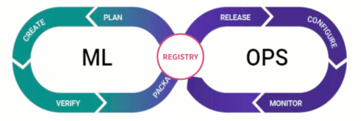

# Model Registry

A model registry is an important component in the lifecycle of AI/ML models, an integral component for any MLOps platform and for ML workflows, serving as the central repository holding metadata pertaining to machine learning models from inception to deployment. This encompasses both high-level details like deployment environment and project origins, as well as intricate information like training hyperparameters, performance metrics, and deployment events. Acting as a bridge between model experimentation and serving, it offers a secure, collaborative interface of a metadata store for stakeholders involved in the ML lifecycle.

The below are links more documentation on Model Registry

1. [Introduction](./introduction.md)
2. [Install Model Registry](./install.md)
3. [Install and using Model Registry using UI](./how-to-use-ui.md)
4. [How to use Model Registry Python library](./getting-started.md)
5. [Deploy a model using UI](./deploy-model.md)

