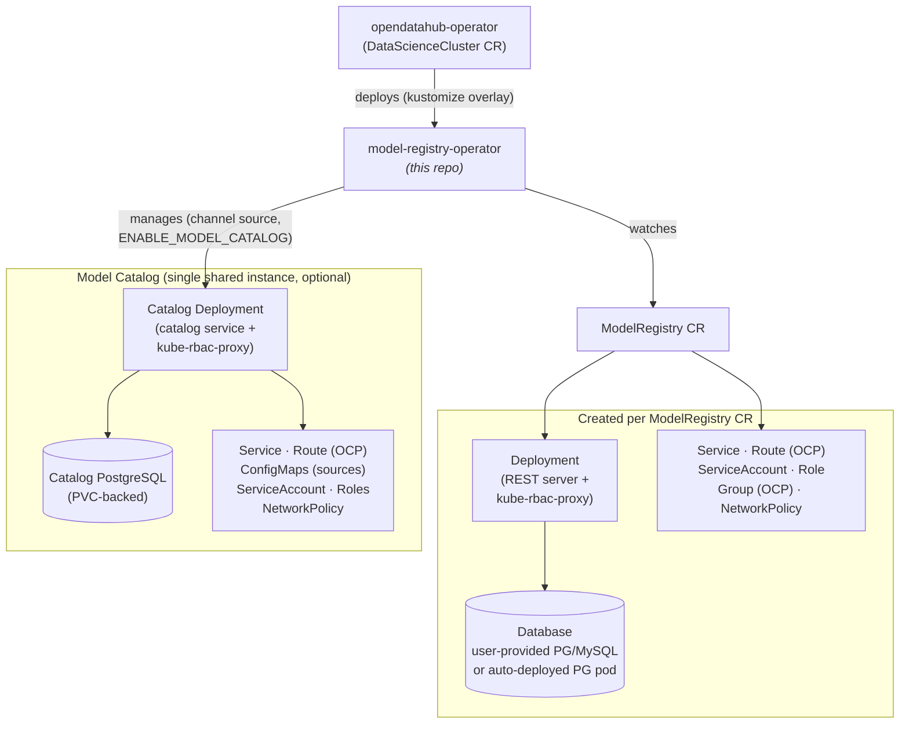

# Architecture

The **model-registry-operator** is a Kubebuilder-based Kubernetes operator that deploys [Model Registry](https://github.com/opendatahub-io/model-registry) instances from `ModelRegistry` Custom Resources, and optionally a shared Model Catalog service.

## Context & Upstream Dependencies

This repo is one piece of a larger system:
- **[opendatahub-io/model-registry](https://github.com/opendatahub-io/model-registry)** — the actual Model Registry server (Go/REST). This operator deploys it via the `REST_IMAGE` container image.
- **[opendatahub-io/opendatahub-operator](https://github.com/opendatahub-io/opendatahub-operator)** — the parent ODH operator. It deploys *this* operator via the `config/overlays/odh/` kustomize overlay when `modelregistry.managementState: Managed` is set in the DataScienceCluster CR.

