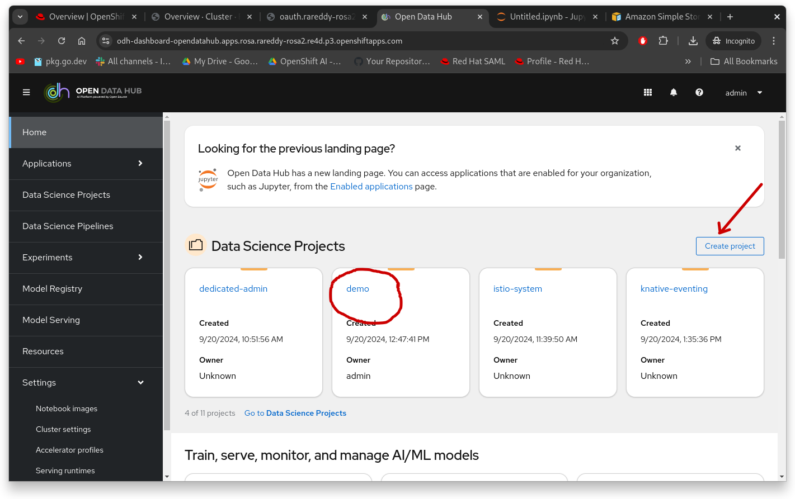
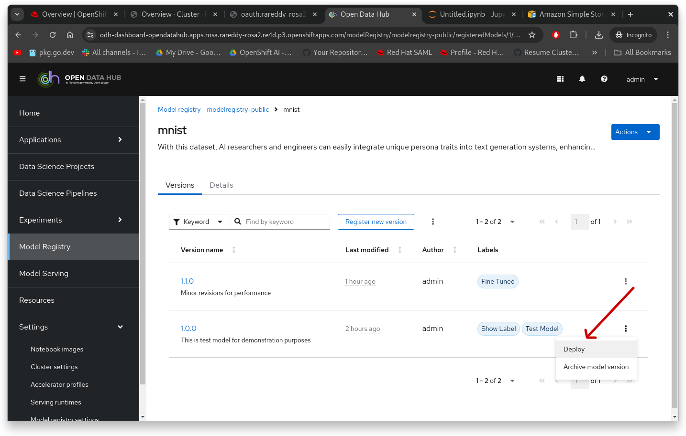
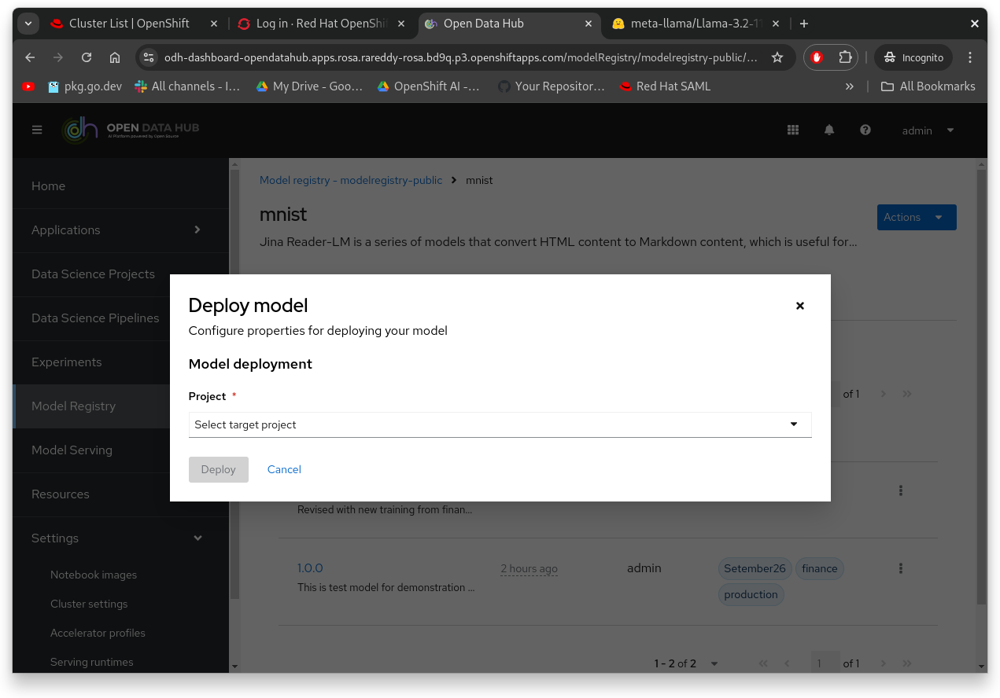
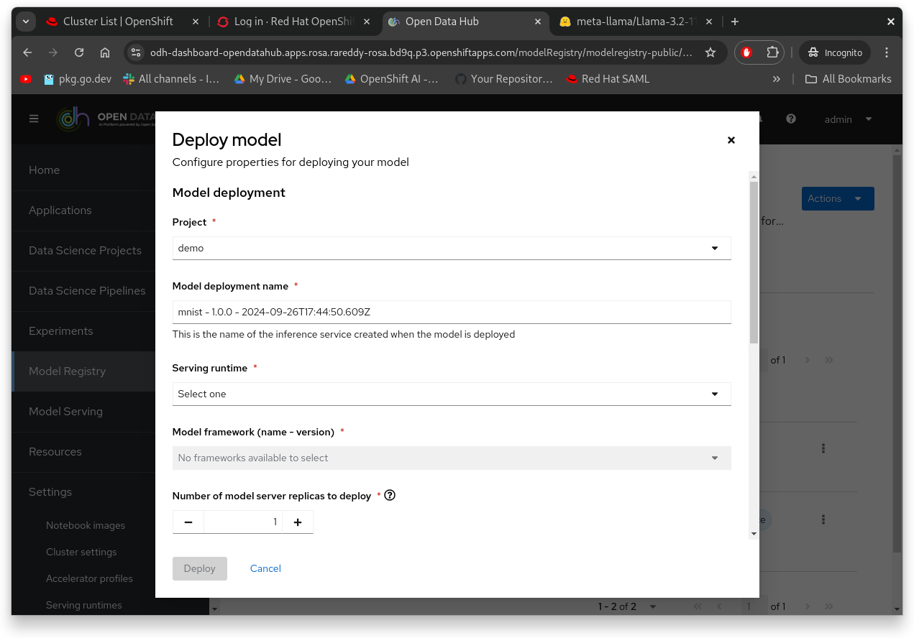
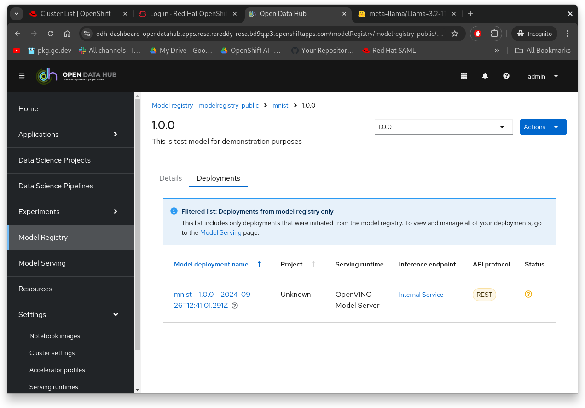

# Deploy Model Using Dashboard

Once the model is designed and uploaded to a S3 bucket and "registered" in the Model Registry, user can choose to deploy the model for inferencing.

It is expected that you have access to Open Data Hub Dashboard. Using the Dashboard, create or use existing "Data Science Project"

Now click on leftnav item "Model Registry", click the model, which will switch to displaying all the model versions under that model name. You can click the kebab menu next to model version and select "deploy" or client on version and then select the "actions" menu to get to the "deploy"

Which pops this window

Select the target "project" you want to deploy this model into from the drop down box. Note that Model Registry is not scoped to a single project, it can scoped to whole cluster, or to more than one project. So it is required that user choose the project where they want to deploy into. Which will bring to this page

On this dialog box please select
* Serving Runtime: Model Runtime server you want to use to run your model
* Model Framework: Select the model framework that model is designed from dropdown list.
* Data Connection: This is one key property user must provide. Since Model Registry only contains metadata information not actual physical model, user need to provide credentials to access the model on S3 bucket. Here if "data connection" is already available in the project you can select to reuse, if not user has option to provide the credentials to the S3 bucket to reach to the model.

Once you make all the other selections, click deploy. This should show the "Deployments" tab and status of the deployment.

You can click on the "inference service" link in the middle of the screen to get to the Inference endpoint that you can use to connect from your application for predictions.