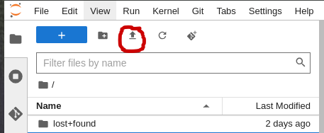

# Model Registry Python Library Usage

This document introduces Model Registry Python library and some of its methods for registering and viewing models inside the Model Registry, however this should not be considered as full library reference. This is only is only used as a document to how start using the Model Registry. Refer the Python library documention for full library reference.

## Prerequisites
It is expected that you have access to Open Datahub Dashboard
<ol>
<li> You have logged into Dashboard
<li> Created a "Data Science Project"
<li> Configured any Cluster Storage.
<li> Configured Data Connections needed for your project. For creating a data conenction you would require connection details for S3 bucket.
<li> Created Workbench and logged into it.
</ol>

once you have a Workbench available, log into the Jupyter Notebook and load this Python Jupyter Notebook [python-example-usage.ipynb](./python-example-usage.ipynb) for further instructions.

To load the note book, click 

 

to load the python notebook and follow directions. 
