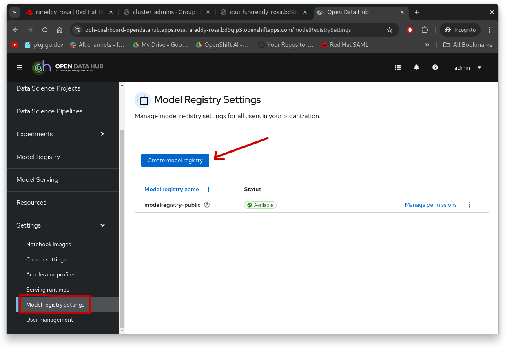
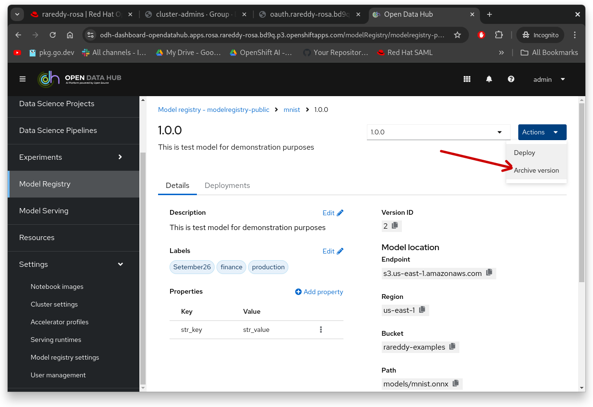

# Model Registry UI

This section of the document goes over Model Registry UI and shows various features of the Model Registry.

## Install Model Registry 

The instructions here show how to install Model Registry using the UI. The instructions [here](./install.md) show how to install using terminal using `oc` command. You can use either one. Please note that in order to install Model Registry using UI, the installer must be in `odh-admin` user group. Please consult your cluster admin other wise.


### Prerequisites 
The following prerequisites are needed for installing Model Registry
<ol>
<li> Access to OpenShift Cluster 4.17 + (recommend)
<li> To install the operators you need "cluster-admin" access
<li> To install Data Science Cluster and Model Registry you need to be `odh-admin` user group. Please if you already in `cluster-admin` role one should already have this role, other wise consult your cluster administrator for requesting access. 
<li> Make sure you have enough capacity on the cluster to install a "data science cluster" minimum is with HCP cluster is 2 nodes of m6i, real world use cases might need to be larger than this. Please consult sizing guides for OpenShift AI.
<li> Model registry currently only works MySQL or MariaDB database, if you have an access to external database collect the credentials for it. You  need `user-id`, `password`, `host`, `port`, `database-name`
</ol>

### Installation

Log "cluster-admin" install the following operators in cluster scope. Please follow the order of their install as, Authorino Operator, Red Hat Serverless Operator, Red Hat Service Mesh operator, and then Open Data Hub Operator.


For installing the "Data Science Cluster", install "DSCi" and "DSC" custom resources, and make sure in DSC custom resource has below to install Model Registry operator

```
modelregistry:
    managementState: Managed
```

when DSC cluster shows in "ready" state. Goto "route" for dashboard setting in "opendatahub" namespace and log into it. Typically there is applications tool bar button in toolbar area you can find the "Open Data Hub Dashboard" link.

Once logged into Dashboard, click on "Settings -> Model Registry", on the screen choose to "Create Model Registry" which should present with the following document



Give the name to Model Registry accordingly representing the business function it represents. Please note that you can install multiple Model Registries in a given cluster with varying degrees of access. For example, you can have Model Registry that public across your whole organization, another one could be across your business unit, or could be just for your team. The access is determined by controlling users in the unique user-group that is created as part of Model Registry installation.


Provide all the database configuration and click "create".

> [!IMPORTANT]  
> The `mysql_native_password` authentication plugin is required for the ML Metadata component to successfully connect to your database. `mysql_native_password` is disabled by default in MySQL 8.4 and later. If your database uses MySQL 8.4 or later, you must update your MySQL deployment to enable the `mysql_native_password` plugin. 
> For more information about enabling the `mysql_native_password` plugin, see [Native Pluggable Authentication](https://dev.mysql.com/doc/refman/8.4/en/native-pluggable-authentication.html) in the MySQL documentation.

Once the status shown as "Ready", you can click on kebab menu and select "manage access" where you can manage the user-group that is mentioned above. Please note that to add users to user group, you need to log into OpenShift console and use User Management screens. Otherwise you can add individual users to "add-user" section to grant access to individual access to the registry created. Please note currently all the access control is based on Kubernetes Authn/AuthZ, there is no options to include third party authentication or authorization systems. Once the access is defined, installation of Model Registry is complete.

### Catalog of Models in Model Registry

Client on left navigation item "Model Registry" on the Dashboard, to take you to screen that shows the catalog of models that are registered in Model Registry. If no models are registered it will show an empty list. If there are registered models you can click to see details of the models


### Register a Model

There are two different ways of registring model in the Model Registry. One using the button in this screen "Register Model" which should pop the following screen. Follow the entries on the screen to register the model. Please note that, Model Registry currently does not actually store the model but it will capture the location of the model where it is stored in a S3 store. First get hold of the model from hugging face or other places, save it into S3 bucket, and provide the details of S3 bucket and its credentials into Register dialog box under "Data Connection" section. Once registered the model will show under model catalog screen.


it will bring this screen for registering a model


Another way register the model is using [Python library](./getting-started.md). Note that when you register a model the first time, it creates a Registered Model entry and related entries for the initial version that is defined. If you ever need to deploy another iteration of the model after re-training, try to add a new Model Version of the model under the original Registered Model entry. A Registered Model can contain any number of Model Versions underneath. Each version is individually managed. The below screen shows when model is drilled down to version level.


and you can click on given model version and see the metadata registered at model version level.


### Deploy Model

A model version can be deployed using "deploy" action from top right. Please follow directions in [here](./deploy-model.md) for deploying a model.

### Archive Model

In Model Registry a model can not be deleted but it can be archived to remove from UI to reduce clutter when the number models deployed are very large. The user can choose to archive individual model versions or they can choose to archive the entire model. 



