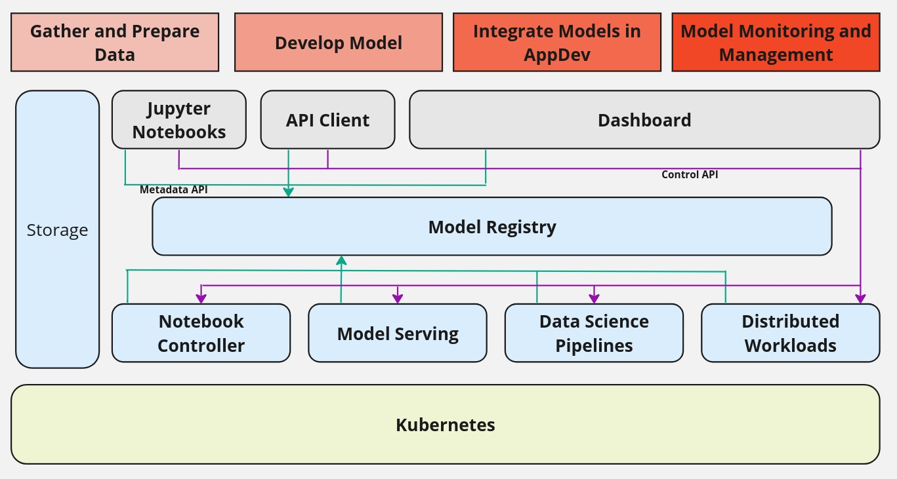

## Highlevel Architecture

The model registry is a backing store for various stages of MLOps that can log user flow of a model development and deployment. The model registry meets a data scientist's need to be able to visualize a model’s lineage and trace back the training executions, parameters, metrics, etc. It also help deployment engineers visualize model pipeline events, actions, progress through deployment stages, etc.

A model registry provides a central index for ML model developers to index and manage models, versions, and ML artifacts metadata. It fills a gap between model experimentation and production activities. It provides a central interface for all stakeholders in the ML lifecycle to collaborate on ML models.

* Create: during the creation phase, the Model Registry facilitates collaboration between different teams in order to track changes, experiment with different model architectures, and maintain a history of model iterations.
* Verify: in the verification stage, the Model Registry supports rigorous testing and validation before progressing further, maintaining a record of performance metrics and test results for each version.
* Package: the Model Registry assists in organizing model artifacts and dependencies, enabling seamless integration with deployment pipelines and ensuring reproducibility across environments.
* Release: when releasing a model, the Model Registry manages the transition of validated versions to production-ready status, helping organization to maintain versioning conventions and facilitating approval workflows.
* Deploy: during deployment, the Model Registry provides information of the approved model versions and associated artifacts, ensuring consistency and traceability across deployment environments.
* Monitor: in the monitoring phase, the Model Registry supports ongoing performance monitoring and model drift detection by maintaining a comprehensive record of deployed models and linking to their performance metrics, facilitating proactive maintenance and retraining as needed.
* DevOps, Data Scientists, and developers need to collaborate with other users in the ML workflow to get models into production. Data scientists need an efficient way to share model versions, artifacts and metadata with other users that need access to those models as part of the MLOps workflow.

## What kind of information Model Registry Can Track

When storing AI/ML models in a Model Registry, capturing comprehensive metadata helps manage model versions, track performance, and streamline collaboration. Below are the key types of metadata you can capture in a model registry. For some of general model information the UI will help provide placeholders, but rest if the information is very specific to individual user as to what they want to track for their models. For that purpose, Model Registry on every object provides two different fields (maps) it provides. 

* metadata: you can capture any metadata defined below
* custom_properties: Any addtional properties of the model you want to track 

Users need to evalaute which information they would like to track and customize their environments to track this information.

### General Model Information
* Model Name: Unique name identifying the model (e.g., customer-churn-prediction).
* Model Version: Specific version number or unique identifier (e.g., v1, v2, commit ID).
* Description: Brief description of the model’s purpose or use case.
* Tags: Custom labels for organizing and filtering models (e.g., production-ready, experiment).
* Framework: The framework used (e.g., PyTorch, TensorFlow, Scikit-learn).
* Model Type: Model type such as classification, regression, clustering, or generative.
* Model File Location: The file path or URL where the model artifacts (e.g., .pkl, .pt, .h5) are stored.

###  Model Owner and Governance
* Author/Owner: The person or team responsible for the model.
* Creation Date: When the model was registered or trained.
* Last Modified Date: The date when the model was last updated.
* Approval Status: Whether the model is approved for production (e.g., development, staging, production).
* Version Control ID: A link to the version control system (e.g., commit hash, GitHub URL).

### Training Data Information
* Training Dataset: The dataset used to train the model (e.g., file name or location in storage).
* Training Data Version: Version or timestamp of the dataset used.
* Dataset Size: The size of the dataset (number of rows/records, file size).
* Data Preprocessing Steps: Any preprocessing or transformations applied (e.g., normalization, encoding).
* Features: List of features used for training, including feature importance or relevance (if applicable).
* Feature Engineering: Any feature engineering steps applied to the dataset.

### Model Performance Metrics
* Training Metrics: Accuracy, precision, recall, F1-score, ROC-AUC for classification, MSE/RMSE for regression.
* Confusion Matrix: For classification models, a confusion matrix showing the performance across classes.
* Log Loss: Performance metric for probabilistic models.
* Training Time: Time taken to train the model.
* Cross-Validation Scores: Scores from cross-validation.
* Inference Latency: Time taken for the model to make predictions during inference.
* Model Size: Size of the model file in memory (useful for deployment).

### Hyperparameters
* Hyperparameter Values: Learning rate, number of epochs, optimizer used (e.g., Adam, SGD), regularization parameters (L1, L2), etc.
* Hyperparameter Tuning: Details about tuning methods like grid search, random search, or Bayesian optimization used during training.

### Compliance and Explainability
* Explainability Metadata: Any model explainability data (e.g., SHAP values, LIME analysis).
* Bias and Fairness Metrics: Any bias or fairness metrics tracked during training or inference.
* Compliance Information: Information related to regulatory requirements (e.g., GDPR compliance, data usage policies).

### Environment and Dependencies
* Training Environment: The computing environment used for training (e.g., hardware details like GPU/CPU, cloud environment).
* Libraries/Dependencies: Versions of libraries and dependencies used (e.g., TensorFlow 2.4, Scikit-learn 0.24).
* Framework: The framework used for training (e.g., PyTorch, Keras, TensorFlow).
* Python Version: The version of Python or other programming languages used.
* Operating System: The operating system where the model was trained (e.g., RHEL).

### Model Deployment
* Deployment Status: The current deployment state of the model (e.g., development, staging, production).
* Serving Environment: Information about where the model is being deployed (e.g., Openshift, AWS, Azure ML, on-premise servers).
* Inference Latency: How long the model takes to make a prediction in production.
* Scaling Information: Details on how the model is scaled (e.g., autoscaling configurations).
* Monitoring Information: Links or references to model monitoring logs, performance data over time.

### Custom Metadata
* Custom Tags: User-defined tags or annotations for searching or organizing models.
* Notes/Comments: Any additional notes or explanations provided by the model developer or reviewer.

The above provided as some guidence on what kind of information can be saved and looked up in a Model Registry, however users need evaluate their needs and come up what metadata they want to track with their models. Model Registry does force beyond some general model information.

